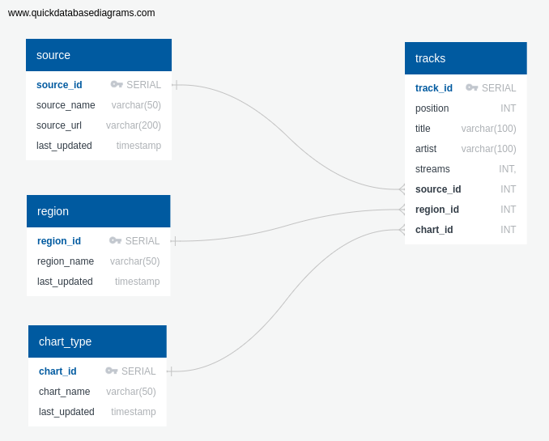

# ETL: Data Wrangling

 * Transform Spotify HTML table into dataframe
 * Spotify __track__ column contains track and artist details
 * Use __split()__ to create separate columns for track title and artist
 * Drop empty columns
 * Rename __rank__ column to __position__
 * Re-order columns
 * Insert new columns (_source_id, chart_id, region_id_) to align dataframe with fields in proposed database table __tracks__

# ETL: Project Activities (Completed)

 - Update web scale function to capture Spotify's _Viral 50_ charts as well as _Top 200_ charts for regions global, US and UK
 - Ensure web scrape function creates dataframe with the desired fields in the "tracks" table. As illustrated in the ERD diagram (ERD_diagram.png)
    
 
    
- Build script (__Create_Tables.sql__) to create tables in "spotify" database with foreign key constraints
- Create CSV's for supporting tables (e.g. _region.csv, _source.csv_ & _chart.csv_)
- Pre-populate supporting tables by importing CSV's using DBeaver
- Export web scrape and load database functions from Jupyter Notebooks 
- Create __webscrape_test.py__ to web scrape Spotify chat and populate __tracks__ table in GCP SQL server
- Create Spotify class (__spotify.py__) with web scrape and load database functions 
- Validate operation from CLI
- Validate __tracks__ table contains 750 records using DBeaver (Top 200 & Viral 50 charts for Global, US, UK)
- Wrote script to create views (__Create_Views.sql__) in DBeaver to quickly filter for respective charts

# ETL: Outstanding Tasks

* Python script to load database does not empty "tracks" table before loading
* Difficulty creating a method to perform (__DELETE FROM tracks ;__) 
* Schedule python script to run periodically with GCP Cloud Scheduler
* Write up
